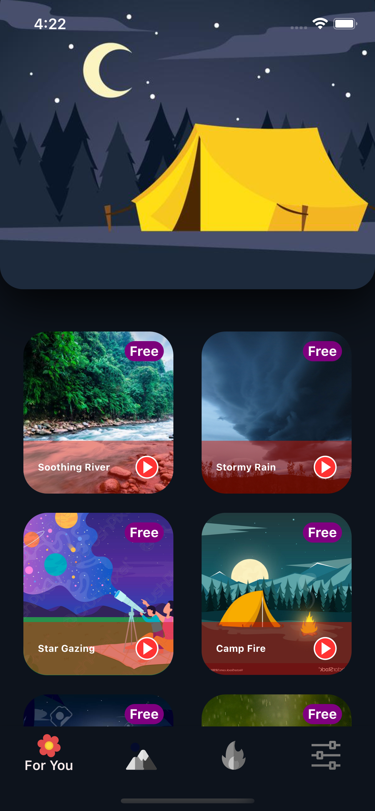
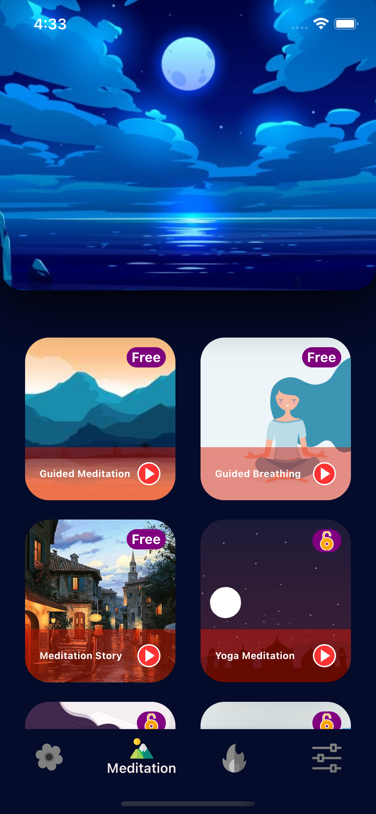
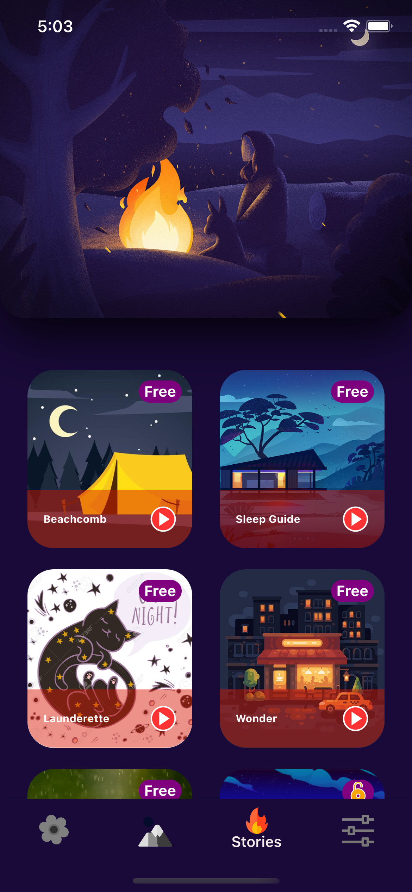

<h1 style="text-align: center;">Sleep App </h1>

Originally inspired by "Sleepiest" App on the IOS store and was pretty much made on the spot to work on the Spot
Built with React Native and inspired by Sleepiest App

<video width="320" height="240" controls>
  <source src="SleepiestApp.mp4" type="video/mp4">
</video>

<!-- <iframe width="320" height="240" align="middle" src="SleepiestApp.mp4"> -->
The Sleep App has sounds like gentle rain drops that are hypnotic in guiding one to sleep.

If sounds are not then some guided meditations are there to help you sleep, where you are gently guided to sleep
##Meditations
Listen from yoga experts who slowly guide your breathing, with slow background music guide you to sleep. So 

  

## Stories
If stories are your thing, then listen to famous stories. Feel relax after listening to a story as if you were in a cafe or being read while you are trying to fall Asleep

  

Whatever you choose, thank you for selecting Sleep App and enjoy the rest of your sleep

## Credits

Audio sources were only used for demonstration purposes of the app and no copyright infrindgements were intended. I do not own any of these audios and links to the owner are below.

1. [My Peace of Mindfulness](https://www.youtube.com/watch?v=WnUlGlUGV7E&list=PLHK-yd45TGzSsy5gQUlf2LYFd20QQ1RnU&index=1&t=1s)
2. [Great Meditation](https://www.youtube.com/watch?v=9MDSem8xQ-8&list=PLHK-yd45TGzSsy5gQUlf2LYFd20QQ1RnU&index=5&ab_channel=GreatMeditationGreatMeditation)
3. [City of Hope](https://www.youtube.com/watch?v=t1rRo6cgM_E&list=PLHK-yd45TGzSsy5gQUlf2LYFd20QQ1RnU&index=6&ab_channel=CityofHopeCityofHope)
4. [Epidemic Ambience](https://www.youtube.com/watch?v=7Vc4-FDGBxo&list=PLHK-yd45TGzSsy5gQUlf2LYFd20QQ1RnU&index=7&ab_channel=CityofHopeCityofHope)
5. [Kennys Relaxation](https://www.youtube.com/watch?v=HCx_L2QwxX4&list=PLHK-yd45TGzSsy5gQUlf2LYFd20QQ1RnU&index=9&ab_channel=EpidemicAmbienceEpidemicAmbience)
6. [Demdrian](https://www.youtube.com/watch?v=JRiDhD3DWZg&list=PLHK-yd45TGzSsy5gQUlf2LYFd20QQ1RnU&index=12&ab_channel=DemdrianDemdrian)
7. [TheSilentWatcher](https://www.youtube.com/watch?v=IvjMgVS6kng&list=PLHK-yd45TGzSsy5gQUlf2LYFd20QQ1RnU&index=13&ab_channel=TheSilentWatcherTheSilentWatcher)
8. [Headspace-1](https://www.youtube.com/watch?v=1q-6d28M0dg&list=PLHK-yd45TGzSsy5gQUlf2LYFd20QQ1RnU&index=14&ab_channel=HeadspaceHeadspaceVerified)
9. [Power Nap](https://www.youtube.com/watch?v=RKGWWTJKXlM&list=PLHK-yd45TGzSsy5gQUlf2LYFd20QQ1RnU&index=15&ab_channel=PowerNapPowerNap)
10. [Sleep and Relaxation Music](https://www.youtube.com/watch?v=Ihq64W33cyo&list=PLHK-yd45TGzSsy5gQUlf2LYFd20QQ1RnU&index=16&ab_channel=SleepandRelaxationMusicSleepandRelaxationMusic)
11. [AboutKidsHealth](https://www.youtube.com/watch?v=2fbaoqkY0Qk&list=PLHK-yd45TGzSsy5gQUlf2LYFd20QQ1RnU&index=17&ab_channel=AboutKidsHealthAboutKidsHealth)
12. [The Honest Guys Meditation](https://www.youtube.com/watch?v=vZNUswv5Fng&list=PLHK-yd45TGzSsy5gQUlf2LYFd20QQ1RnU&index=18&ab_channel=TheHonestGuys-Meditations-RelaxationTheHonestGuys-Meditations-Relaxation)
13. [Headspace-2](https://www.youtube.com/watch?v=9OHvPNatlBc&list=PLHK-yd45TGzSsy5gQUlf2LYFd20QQ1RnU&index=19&ab_channel=HeadspaceHeadspaceVerified)
14. [Headspace-3](https://www.youtube.com/watch?v=9OHvPNatlBc&list=PLHK-yd45TGzSsy5gQUlf2LYFd20QQ1RnU&index=19&ab_channel=HeadspaceHeadspaceVerified)
15. [Headspace-4](https://www.youtube.com/watch?v=soQJrB732xM&list=PLHK-yd45TGzSsy5gQUlf2LYFd20QQ1RnU&index=20&ab_channel=HeadspaceHeadspaceVerified)
16. [Headspace-5](https://www.youtube.com/watch?v=9oDt2Qkc2jQ&list=PLHK-yd45TGzSsy5gQUlf2LYFd20QQ1RnU&index=21&ab_channel=HeadspaceHeadspaceVerified)
